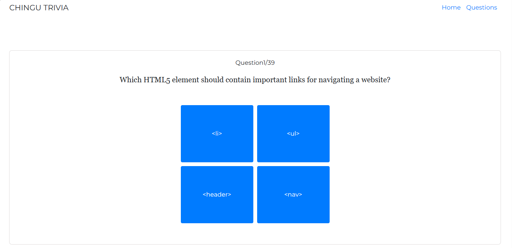
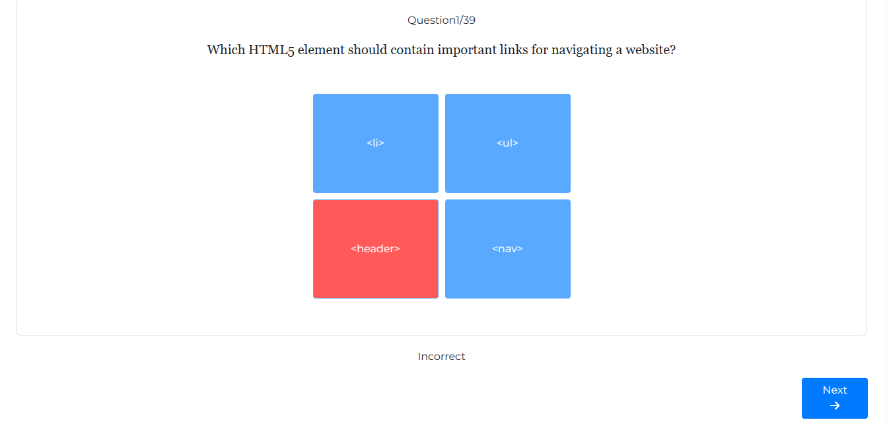
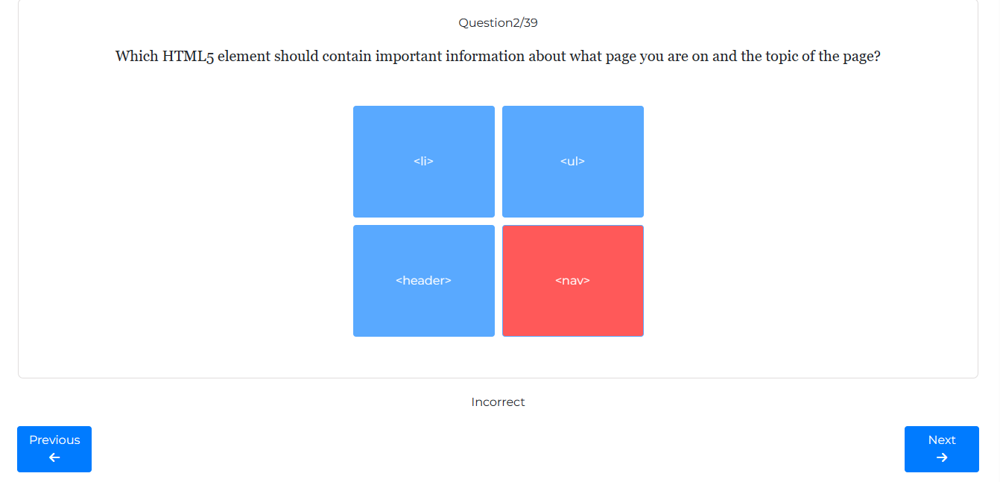
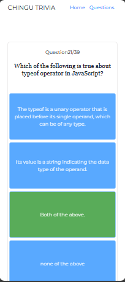

# Quiz App

## Overview

This web app, built with vanila JavaScript and enhanced with Bootstrap, Google Fonts, and Font Awesome, provides a sleek and user-friendly experience for users to answer a series of questions and provides score on their performance upon completion. Check it out to explore the seamless blend of simplicity and functionality!

## Access

The app can be accessed by a simple click-
[try it](https://bitscurrent.github.io/quizApp-version-2/)

## Features

- Responsive.
- Interactive quiz interface.
- Questions are presented one at a time.
- Users can select an answer from multiple choices.
- Immediate feedback on the correctness of each answer.
- Users can navigate to the next question after answering.
- It is also possible to navigate to the previous question.
- Scores are displayed at the end of the quiz.
- App has favicon.

## How it works

The data is fetched from the API [Click Here](https://johnmeade-webdev.github.io/chingu_quiz_api/trial.json).
This is then proccessed.

## Screenshots

